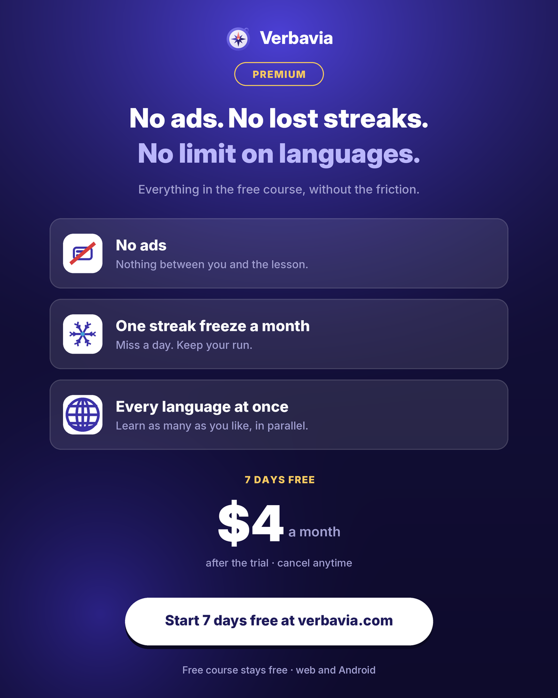

# Verbavia Premium — ad



Static ad for the paid tier. Companion to `README_AD.md` (the free-course ad);
where that one is light and screenshot-led, this one is dark indigo so the two
read as different products at a glance in a feed.

## Outputs

| File | Size | Use |
|---|---|---|
| `verbavia_premium.png` | 1080×1350 (4:5) | Instagram / Facebook feed — the master |
| `verbavia_premium_story.png` | 1080×1920 (9:16) | Stories, Reels, TikTok still |
| `verbavia_premium_square.png` | 1080×1080 (1:1) | Square feed, X, thumbnails |

## Copy

- Badge: **PREMIUM**
- Headline: *No ads. No lost streaks. / No limit on languages.*
- Sub: *Everything in the free course, without the friction.*
- Rows (the three benefits requested):
  1. **No ads** — Nothing between you and the lesson.
  2. **One streak freeze a month** — Miss a day. Keep your run.
  3. **Every language at once** — Learn as many as you like, in parallel.
- Price: **7 DAYS FREE** · **$4 a month** · *after the trial · cancel anytime*
- CTA: *Start 7 days free at verbavia.com*
- Footer: *Free course stays free · web and Android*

## Assumptions — read before publishing

The premium tier **does not exist on verbavia.com yet**. `/premium`, `/pricing`,
`/plus`, `/upgrade` and `/account` all return the same SPA shell, so unlike the
free-course ad nothing here could be scraped — every line of copy is new and is
yours to approve or change.

Two specific reads to confirm:

- **"$4" was taken as $4 per month.** If it is a one-off or a yearly price,
  change `a month` on line ~100 of `make_ad_premium.py` and the footer line.
- **"Free course stays free"** is a claim about your business, not something
  the site states. Drop it if you'd rather not commit to it.

Also: an App Store / Play Store listing with a free trial has to disclose the
renewal terms — the *after the trial · cancel anytime* line is there for that,
keep it if the ad runs anywhere those rules apply.

## Rebuilding

```bash
pip install pillow numpy
python3 make_ad_premium.py           # -> verbavia_premium.png  (1080×1350)
python3 make_ad_premium_variants.py  # -> _story.png, _square.png
```

Rendered at SS=3 (3240×4050) and downsampled with LANCZOS, so text edges stay
clean. The compass mark is drawn from `verbavia_logo.svg` via `render_svg.py`
(see `README_KILL.md` for why the logo is a vector rebuild rather than a scrape).

The two variants are produced by edge-row/edge-column extension of the master
rather than a re-layout — the background gradient is uniform along each edge, so
the pad is seamless and the type never rescales between sizes.
